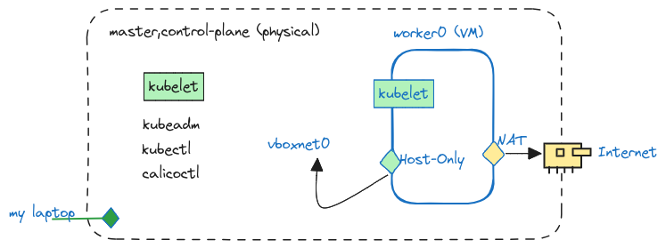

Introduction
============

Welcome to a quick-start to install your k8s cluster faster!

To properly init your first cluster, you need one releavent page which is: the official project documentation [https://kubernetes.io/docs](https://kubernetes.io/docs)

Why is a hard way ?
===================
Because you will setup a cluster from scratch!

Kubernetes is a project offering a lot of tools.

The hard way consist of: putting all pieces together to build your cluster.

Your first try to bootstrap a cluster !
=======================================

The kubeadm command will [boostrap a k8s cluster](https://kubernetes.io/docs/setup/production-environment/tools/kubeadm/) for you.

Download it from [this page](https://kubernetes.io/releases/download/)

Then you run the command on your PC/Laptop or any other Linux based system:
```
master:/app/k8s/bin # kubeadm init

I0602 11:00:13.928085    9376 version.go:255] remote version is much newer: v1.30.1; falling back to: stable-1.22

[init] Using Kubernetes version: v1.22.17

[preflight] Running pre-flight checks

[preflight] WARNING: Couldn't create the interface used for talking to the container runtime: docker is required for container runtime: exec: "docker": executable file not found in $PATH

[WARNING Firewalld]: firewalld is active, please ensure ports [6443 10250] are open or your cluster may not function correctly

[WARNING Service-Kubelet]: kubelet service is not enabled, please run 'systemctl enable kubelet.service'

error execution phase preflight: [preflight] Some fatal errors occurred:

[ERROR Swap]: running with swap on is not supported. Please disable swap

[preflight] If you know what you are doing, you can make a check non-fatal with --ignore-preflight-errors=...

To see the stack trace of this error execute with --v=5 or higher
```
Every filled preflight requirement is a step, on the hard way, to get your Kuberntes cluster ready!

The minimal resources
=====================
A minimal lab could be:



1. The control plane is installed on a 8GB memory/Intel-i5 CPU laptop (Opensuse LEAP 15.5)
2. The worker is installed on a Virtualbox VM (Rocky 9). 

The VM must have two NICs as described. One for local connexion and a NAT to connect to Internet (docker registry ...)

Deploy the lab
==============

```
$ cd ansible
$ make prepare
$ ansible-playbook -i inventories/lab install.yml 
```

